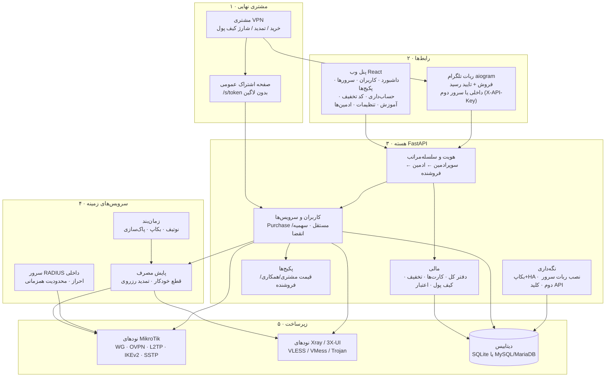

# نقشه کلی پروژه یوزر منیجر

مرجع یک‌نگاهی کل سیستم - برای دیدن جای هر قابلیت و مسیر داده‌ها.
(آخرین به‌روزرسانی: 2026-08-08 · طرح حساب‌داری: `accounting-design.md`)

## لایه‌ها در یک نگاه

**رابط‌ها.** پنل وب React (سرو از کانتینر nginx) و ربات تلگرام. ربات یا در همان کانتینر بک‌اند اجرا می‌شود (`panel_bridge` - فراخوانی مستقیم) یا روی سرور دوم (`remote_bridge` - HTTP به `/api/bot/*` با X-API-Key؛ استقرار از تنظیمات ← «نصب ربات روی سرور دیگر» با SSH). **نکته عملیاتی مهم: آپدیت سرور اصلی، سرور دومِ ربات را خودکار آپدیت نمی‌کند - باید نصب ربات را دوباره زد.**

**هسته.** FastAPI + SQLAlchemy. سلسله‌مراتب سه‌سطحی (`services/hierarchy.py`) روی همه‌چیز اعمال می‌شود: هر ادمین فقط درخت خودش را می‌بیند. هر خرید یک `Purchase` مستقل با سهمیه/انقضای خودش است (سرویس‌های قدیمیِ استخر مشترک با مهاجرت یک‌باره‌ی `services/purchase_migration.py` تبدیل شده‌اند - 2026-08-09). **تمدید = ادامه‌ی همان سرویس**: پکیج جدید روی همان Purchase رزرو می‌شود (نه سرویس جدید)؛ ربات هنگام تمدیدِ مشتریِ چندسرویسه اول می‌پرسد کدام سرویس. بخش مالی همه رویدادها را در دفتر کل (`ledger_entries`) ثبت می‌کند - جزئیات در `accounting-design.md`.

**سرویس‌های زمینه.** سرور RADIUS داخلی برای احراز PPP/L2TP/IKEv2/SSTP و محدودیت اتصال همزمان؛ پایش دوره‌ای مصرف که سهمیه/انقضا را اجرا و تمدیدهای رزروی را فعال می‌کند؛ زمان‌بند APScheduler برای نوتیف روزانه، بکاپ زمان‌بندی‌شده و HA.

**زیرساخت.** نودهای MikroTik (API روتر) و Xray/3X-UI (SSH یا API). دیتابیس SQLite پیش‌فرض یا MySQL/MariaDB (انتخاب هنگام نصب)؛ ستون‌های جدید در استارتاپ خودکار مهاجرت می‌شوند.

## پرونده‌های کلیدی برای هر حوزه

| حوزه | فایل‌های اصلی |
|---|---|
| مدل‌های داده | `backend/app/models.py` |
| ساخت/تمدید/Purchase | `backend/app/services/user_ops.py` · `routers/users.py` |
| حساب‌داری | `services/accounting.py` · `routers/accounting.py` · `frontend/src/pages/Accounting.jsx` |
| کارت‌های پرداخت | `services/payment_cards.py` |
| ربات | `backend/app/telegram_bot/` (handlers، bridges، storage) |
| RADIUS و پایش | `services/radius_server.py` · `services/quota_manager.py` |
| نودها | `services/mikrotik_client.py` · `services/xray_client.py` · `services/threexui_client.py` |
| صفحه ساب مشتری | `routers/subscription.py` · `frontend/src/pages/Subscription.jsx` |
| قالب OpenVPN پکیج | `services/link_builder.py` (`render_ovpn_template`) · `models.Package.ovpn_template` |
| مانیتور منابع نودها | `services/node_monitor.py` · `routers/nodes.py` (`/nodes/resources`) |
| بکاپ/HA | `services/backup.py` |
| استقرار ربات سرور دوم | `services/remote_deploy.py` · `routers/remote_bot.py` |
